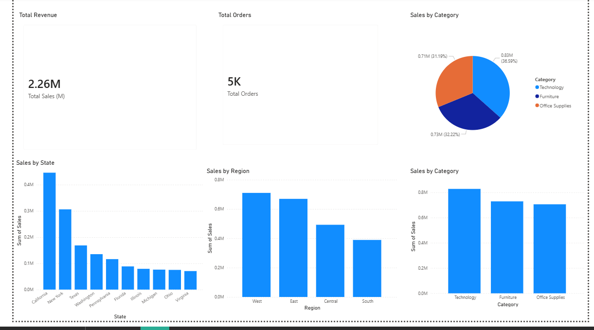

# Retail Sales Analysis Dashboard

## About this project
This is a personal project where I explored a retail sales dataset and turned it into a simple but clear dashboard.

I wanted to practice how real data analysts work — cleaning messy data, analyzing it, and then showing insights in a way people can understand.

---

## Tools I used

- **Python (Pandas)**  
  Used to clean the data — fixing dates, handling missing values, and preparing the dataset for analysis.

- **SQL**  
  Used to analyze the data — writing queries to find total sales, top regions, best categories, and more.

- **Power BI**  
  Used to build an interactive dashboard — turning the data into visuals like charts and KPIs.

---

## What I did

- Cleaned raw data using Python  
- Used SQL to explore and answer business questions  
- Built a dashboard to show:
  - total sales  
  - total orders  
  - sales by region  
  - sales by category  
  - top states  

---

## Key insights

- Total sales reached around **$2.26M**  
- Over **5,000 orders** were analyzed  
- The **West region** had the highest sales  
- **Technology** was the top category (~35% of sales)  
- **California and New York** were the top-performing states  

---

## Dashboard

Here is a preview of the dashboard:

---

## Note
This is a personal learning project built to improve my data analysis skills using real-world tools.

---

## Author
Vanessa Ineza Nikita
